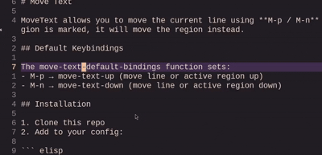

# Move Text

MoveText allows you to move the current line using **M-p / M-n** (or any other bindings you choose). If a region is marked, it will move the region instead.

## Default Keybindings

The move-text-default-bindings function sets:
- M-p → move-text-up (move line or active region up)
- M-n → move-text-down (move line or active region down)

## Installation

1. Clone this repo
2. Add to your config:

``` elisp
(add-to-list 'load-path "/path/to/this/repo")
(require 'move-text)
(move-text-default-bindings)
```

## Demonstration



## Original Version

This is a modified version of emacsfodder/move-text.
Changes include:

- Default bindings changed to M-p / M-n
- Region always expands to whole lines
